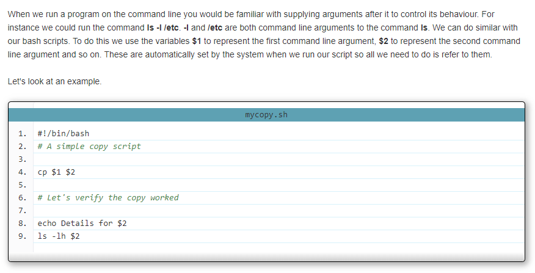
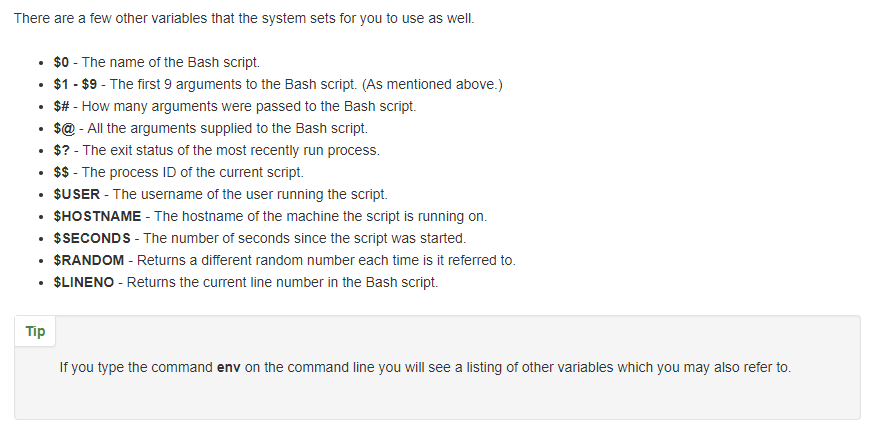

# BASH Variables

To read the variable we place its name (preceded by a $ sign) anywhere in the script we would like.
 
 * Before Bash interprets (or runs) every line of our script it first checks to see if any variable names are present. 
    * For every variable it has identified, it replaces the variable name with its value. 
    * Then it runs that line of code and begins the process again on the next line.

 * Some people like to always write variable names in uppercase so they stand out. It's your preference however. 
    * Variables in BASH can be all uppercase, all lowercase, or a mixture.
 
## Command Line Arguments

## Other Special Variables

