# Unix Notes

* Search for a manual
```bash
man -k

man -k make # This shows all possibilities of make command for manual

man -k date | head -18
# head -18? That limits the output of the man command to just the first 18 lines.

```

* Learn what is
```bash
# whatis is alias for man -k
# man -k make for examples same as whatis make

whatis make 
# make (1)             - GNU make utility to maintain groups of programs

whatis mkdir
# mkdir (1)            - make directories

```
* get help
```bash
ls --help 
ls -h 
```

* exit the current user session in the command line pc case, the terminal in the case of GUI computers
```bash
exit
```

* find out who the current user are
```bash
whoami
```

* The purpose of this command is to tell you what group or groups you’re in and the numeric identifier for your account name
```bash
id
```

* who else is there?
```bash
users

who

w  # who they are, and what are they doing ?
```

* show date
```bash
date
```

* learn host machine name
```bash
hostname
```

```bash
cd / # change directory into root directory
cd   #  "       ""      into home directory
```

* You can obtain a listing of the files and directories in your own top-level directory
```
ls -F
# Any filename that ends with a slash (/) is a folder (Unix calls these directories). 
# Any filename that ends with an asterisk (*) is a program. 
# Anything ending with the at sign (@) is a symbolic link (a pointer to another file or directory elsewhere in the file system)
# and everything else is a normal, plain file.
```
---

### The bin Directory

The bin directory is where all the executable binaries were kept in early Unix. Over time, as more and more executables were added to Unix, having all the executables in one place proved unmanageable, and the bin directory split into multiple parts with different purposes (/bin, /sbin, /usr/bin).

### The dev Directory

All device drivers—often numbering into the hundreds—are stored as separate files in the standard Unix dev (devices) directory.

Remember, everything in Unix is a file. Every component of the system, from the keyboard driver to the hard disk, is a file.

### The etc Directory

Unix administration can be quite complex, involving management of user accounts, the file system, security, device drivers, hardware configurations, and more. To help, Unix designates the etc directory as the storage place for all administrative files and information.

### The lib Directory

Unix has a central storage place for function and procedural libraries. These specific executables are included with specific programs and allow programs to offer features and capabilities that are otherwise unavailable. 

### The lost+found Directory

When files are recovered after any sort of problem or failure, they are placed here, in the lost+found directory, if the kernel cannot ascertain the proper location in the file system.

### The mnt and sys Directories

The mnt directory is intended to be a common place to mount external media—hard disks, removable cartridge drives, and so on—in Unix. On many systems, though not all, sys contains files indicating the system configuration.

### The tmp Directory

tmp is used by many of the programs in Unix as a temporary file-storage space.

---

if a filename begins with /, it’s absolute.

A hidden file is any file with a dot as the first character of the filename.

* The output of the `env` command shows some of the standard environment variables.
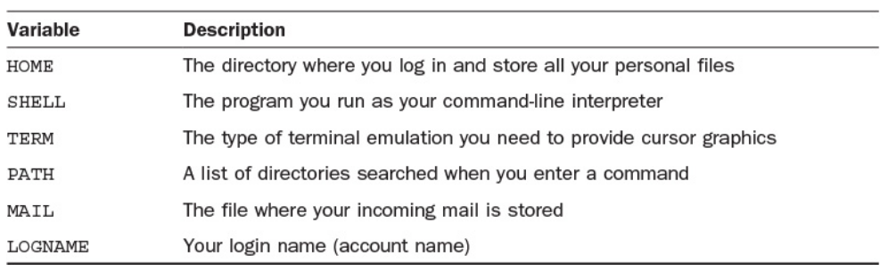

* The two most important values in your environment are the name of your home directory (HOME) and your search path (PATH). 

* Your home directory (as it’s known) is the name of the directory in which you always begin your Unix session.

* The PATH environment variable lists the set of directories, **in left-to-right order**, that the system searches to find commands and applications you request.

```bash
$ echo $PATH
/home/taylor/bin:/bin:/usr/bin:/usr/ucb:/usr/local/bin:/usr/unsup/bin:.
$ echo $HOME
/home/taylor
$
```

* Find Where You Are with pwd
```
$ pwd
/home/taylor
```

* Without any directory specified, cd moves you back to your home directory automatically
```bash
$ cd
$ pwd
/home/taylor
```

* **absolute filename** Any filename that begins with a leading slash (/); it uniquely describes a single file in the file system.

* Enter `ls -s` to find out file sizes:

* if you see an @ after a filename, it’s a link to another spot in the file system.

* The -m flag outputs the files as a comma-separated list. 
```bash
  % ls -m
  Archives, InfoWorld, LISTS, Mail, News, OWL, RUMORS.18Sept,
  bin, iecc.list, mailing.lists, newels, src
```

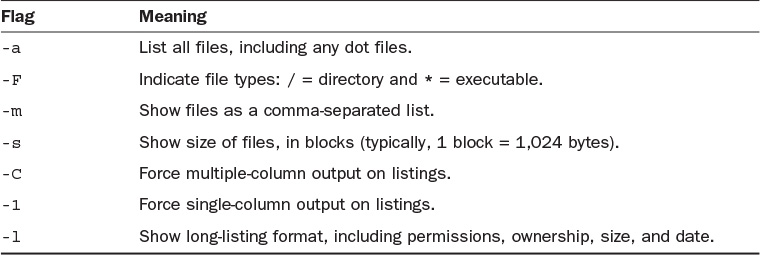

* -d flag, which forces ls to list directories rather than their contents. 

##  Changing the Sort Order in ls

* -x makes sort order row first instead of default behaviour(column first.)
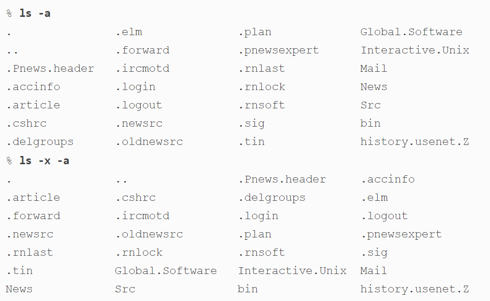

* -t sorts by most recently accessed to least recently accessed
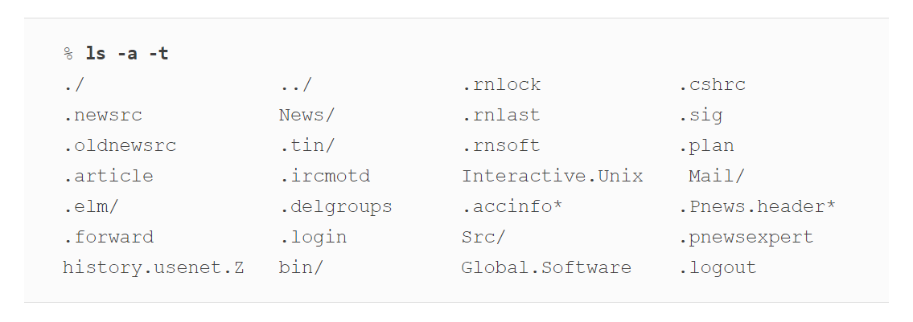

* -r flag reverses any sorting order
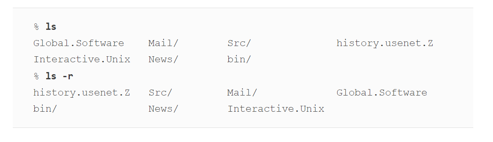

* -R flag, which causes ls to recursively list directories below the current or specified directory. 
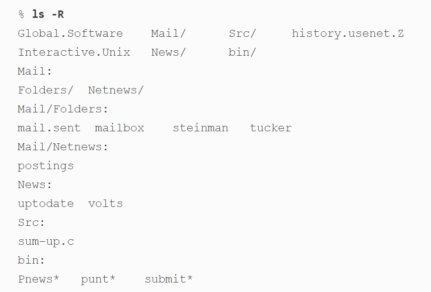

## Permission Strings

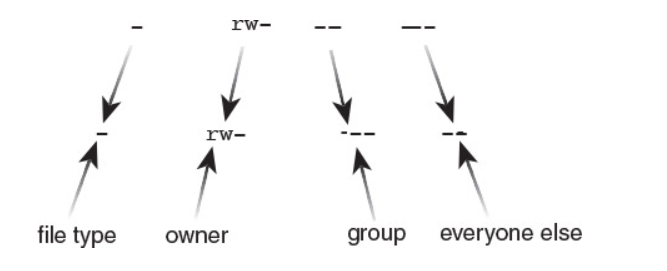

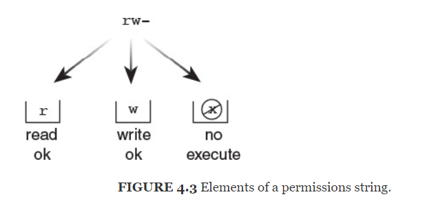

* The system keeps track of whether a file is executable because that’s one way it knows whether the name is the name of a file or the name of an application.

* Remember that you must have both read and execute permissions for a directory. If you have either read or execute permission but not both, the directory will not be usable (as though you had neither permission). Write permission, of course, enables the user to alter the contents of the directory or add new files to the directory.

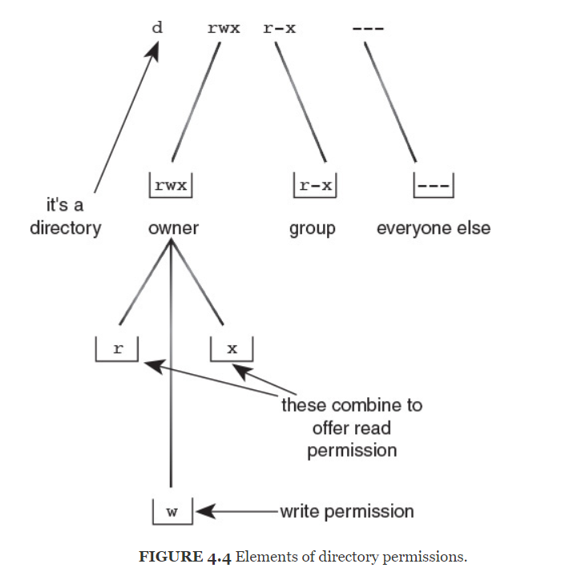

## ls flag summary

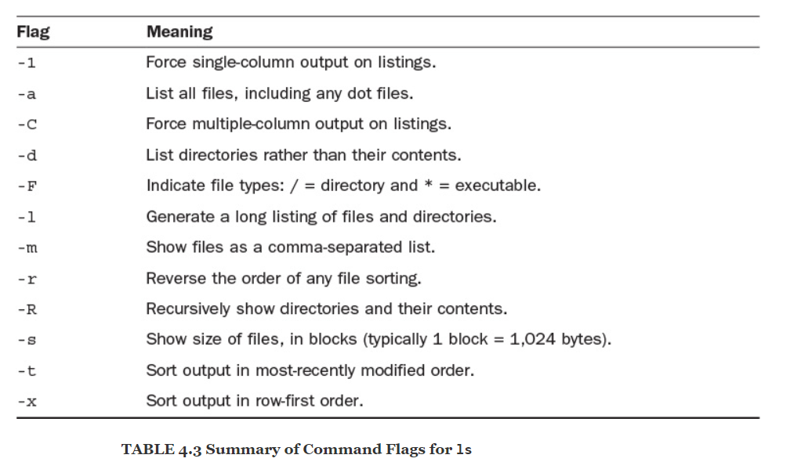

## create files with touch


## learn about the state

*  The du command lists the size, in kilobytes, of all directories at or below the current point in the file system.
    
    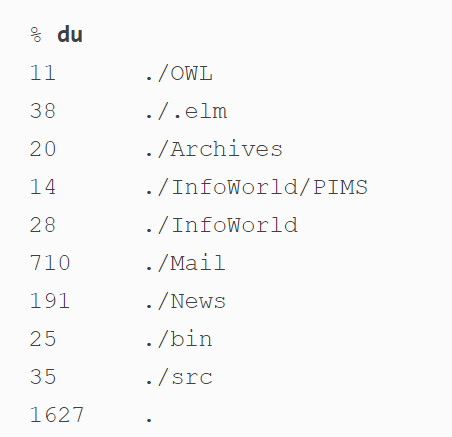
    
   * use the -h option to display the sizes in human-readable format, with K and M suffixes.
   
     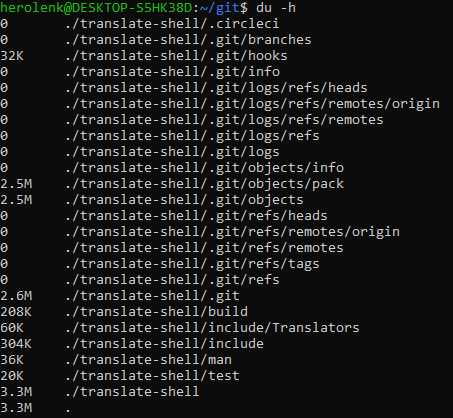
    
   * use the -s flag to output just a summary of the information.
    
      
      
   * The du command summarizes disk usage only for the files and directories it can read
   * Although by default du lists only the sizes of directories, it also computes the size of all files. If you’re interested in that information, you can, by adding the -a flag, have the program list it for all files:
        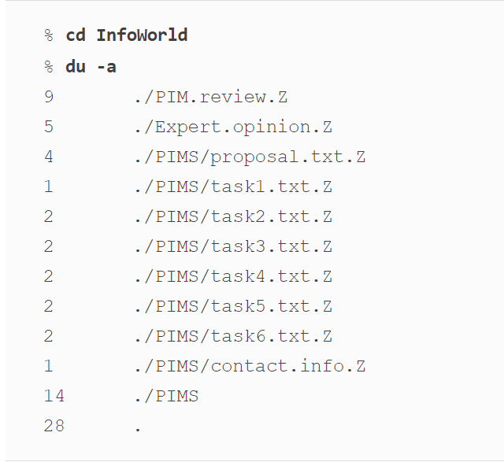
        
## Checking Available Disk Space with df

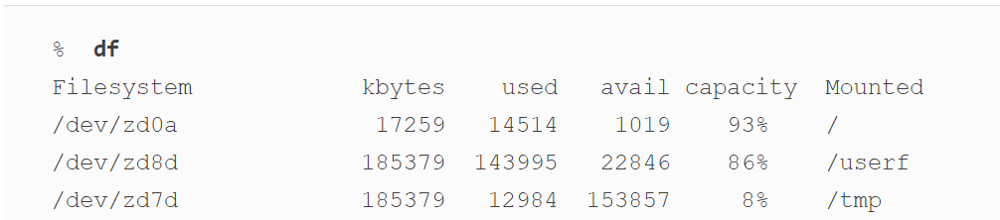

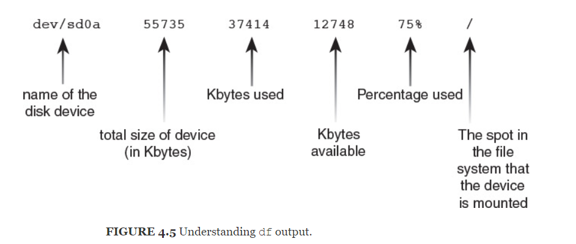

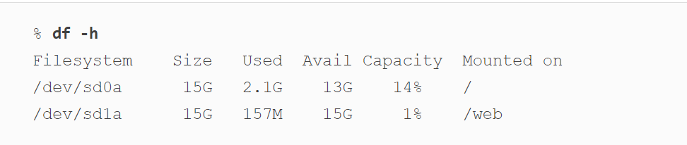

## Shrinking Big Files with the gzip Program

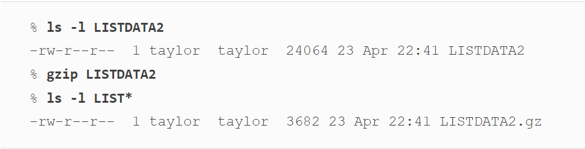

*  Using gzip on bigger files can show even greater savings (note that I’m also adding the -v flag, which shows how much savings I’ve gained by using gzip on the file in question):

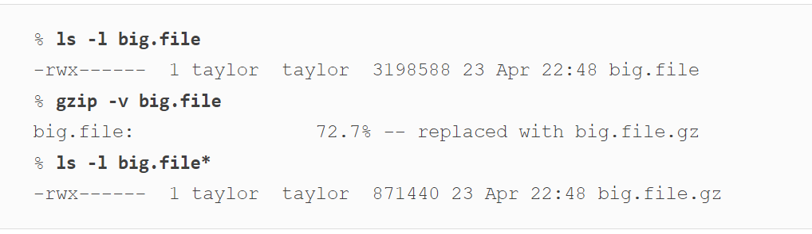

*  To reverse the operation, use the companion command gunzip and specify either the current name of the file (that is, with the .gz suffix) or the name of the file before it was compressed (that is, without the .gz suffix):

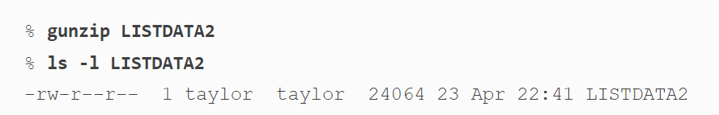

> Why would you compress files? You would do so to save file space. Before you use any of the compressed files, though, you must uncompress them, so the gzip utility is best used with large files you won’t need for a while.

### gzip alternatives

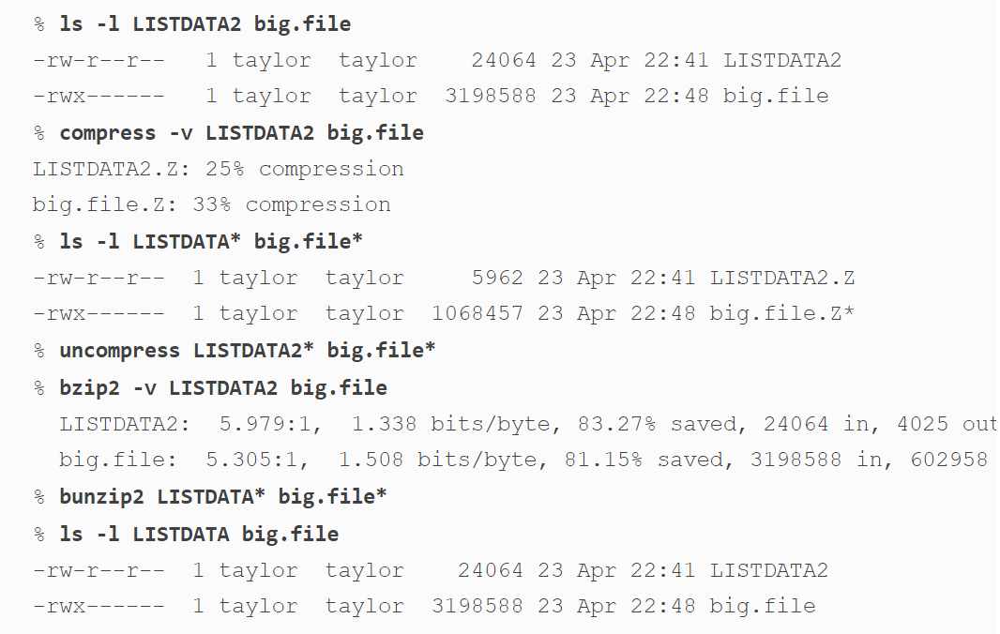